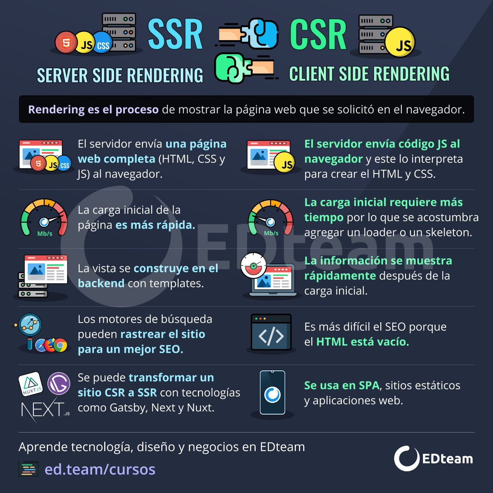

# Clase 01 - React.js Developers

## Herramientas/aplicaciones necesarias

* Visual Studio Code <https://code.visualstudio.com/>
* Node <https://nodejs.org/en>
* NVM (Node Version Manager) <https://github.com/coreybutler/nvm-windows/releases>

> Verificando que tenga instalado nvm

```sh
nvm version
```

> listar versiones de node

```sh 
nvm list
```

> Instalar versión de node

```sh
nvm install <numero-version>
nvm install 20.12.1
```

> Usar una versión instalada

```sh
nvm use 20.12.1
```

* Git

> Verificar si tengo git instalado

```sh
git --version
```
* Github <https://github.com/>
* Netlify <https://www.netlify.com/>
* 000webhost <https://ar.000webhost.com/>


## REACT 
Es una librería (Interfaces web) -> No me alcanza para construir una aplicación web.

## Páginas oficiales

* React (Aplicaciones Web) <https://es.react.dev/>
* React -> antigua -> <https://legacy.reactjs.org/>
* React Navite ( Aplicaciones mobile -> Android y iOS )

## Infografía historia React


## Virtual DOM


## Pensando en componentes

<https://es.react.dev/learn/thinking-in-react>

## JSX

<https://es.react.dev/learn/writing-markup-with-jsx>

## Babel

<https://babeljs.io/>

## Webpack

<https://webpack.js.org>

## Creacion de estructura y configuracion para arrancar a desarrollar 

<https://create-react-app.dev>
<https://vitejs.dev>

## Server Side Rendering VS Client Side Rendering

