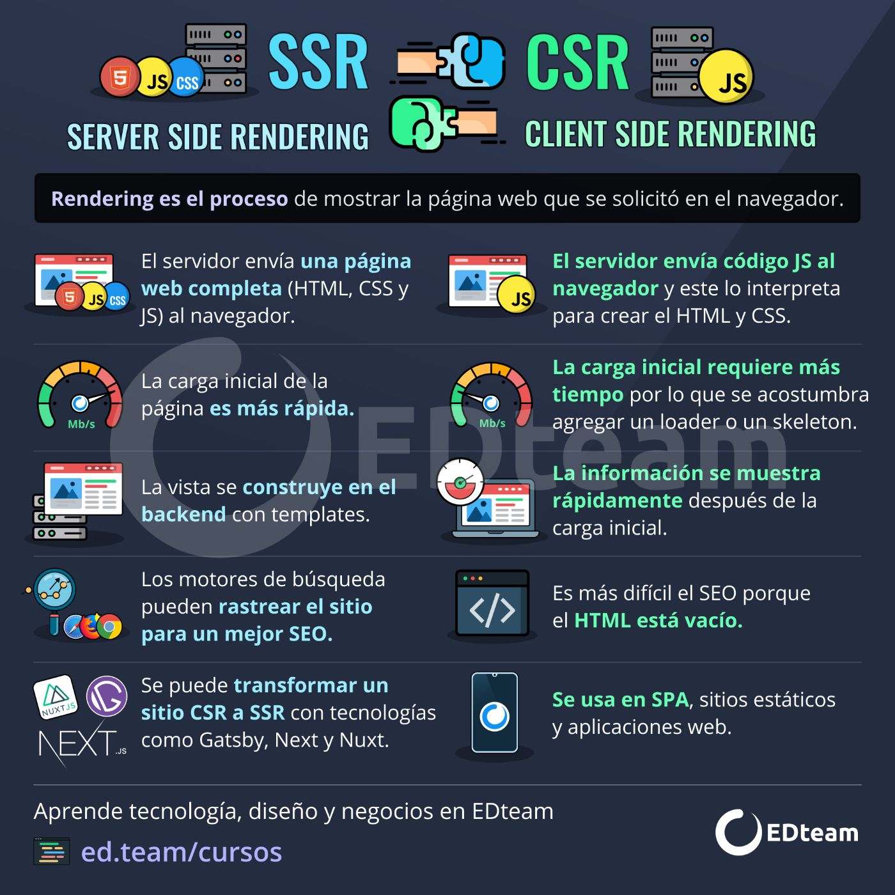

# Clase 02 - React.js Developers

## Webpack

<https://webpack.js.org/>

## Creacción de estructura y configuración para arracar a desarrollar

<https://create-react-app.dev/>
<https://vitejs.dev/>

## Server side Rendering vs Client side Rendering



## Next

<https://nextjs.org/>

## Vite

### Para crear la estructura base de react

```sh
npm create vite@latest    # Crea la carpeta y la estructura del proyecto
npm create vite@latest ./ # ./ => la estructura base se va a crear en el directorio que tiene abierto en vsc
npm create vite@latest ./ -- --template react   # Estructura de proyecto netamente React
```

### Instalando dependencias

**IMPORTANTE**: Para que funciones el _npm i_ tiene que estar el package.json dentro del directorio actual

```sh
npm install
```

### Arrancamos el servidor de desarrollo

```sh
npm run dev
```

### Deteniendo el servidor de desarrollo

Ctrl + C

### Extensiones Visual Studio CODE

- Auto Rename Tag (formulahendry.auto-rename-tag)
- Better Comments (aaron-bond.better-comments)
- ES7+ React/Redux/React-Native snippets (dsznajder.es7-react-js-snippets)
- Material Icon Theme (PKief.material-icon-theme)
- Shades of Purple (ahmadawais.shades-of-purple)
- Thunder Client (rangav.vscode-thunder-client)
- Todo Tree (Gruntfuggly.todo-tree)
- Error Lens (usernamehw.errorlens)
- ESLint (dbaeumer.vscode-eslint)
- Version Lens (pflannery.vscode-versionlens)
- Template String Converter (meganrogge.template-string-converter)
- Prettier - Code formatter (esbenp.prettier-vscode)
- Image preview (kisstkondoros.vscode-gutter-preview)

## Prettier

<https://prettier.io/>
